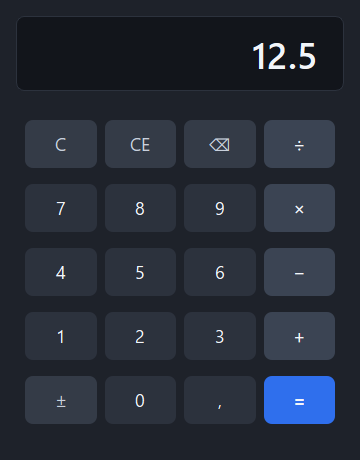

# Calculatrice

Calculatrice de bureau à quatre opérations, écrite en **Python 3.11+** avec une
interface **Qt 6 (PySide6)**.

Ce dépôt est volontairement conçu pour évoluer par incréments successifs sans
intervention manuelle sur le code : cœur métier séparé de l'interface, tests
automatisés (unitaires *et* graphiques), vérifications de qualité et intégration
continue bloquante.



## Fonctionnalités

- Addition, soustraction, multiplication, division.
- Arithmétique **décimale exacte** (`decimal.Decimal`) : `0,1 + 0,2` donne bien `0,3`.
- Enchaînement des opérations (`2 + 3 × 4 =` évalué de gauche à droite, comme une
  calculatrice de bureau), répétition de la dernière opération avec `=`.
- Correction (`⌫`), effacement de la saisie (`CE`), remise à zéro (`C`),
  changement de signe (`±`), séparateur décimal.
- Gestion explicite des erreurs : division par zéro et dépassement de capacité
  affichent un message, et seules les touches `C`/`CE` réarment la calculatrice.
- Pilotage complet au clavier.

## Démarrage rapide

```bash
# 1. Environnement (uv, recommandé)
uv venv --python 3.12
uv pip install -e ".[dev]"

# 2. Lancement
uv run calculatrice          # ou : python -m calculatrice
```

Sans `uv` :

```bash
python -m venv .venv
.venv/bin/pip install -e ".[dev]"   # Windows : .venv\Scripts\pip install -e ".[dev]"
python -m calculatrice
```

## Raccourcis clavier

| Touche | Action |
| --- | --- |
| `0`–`9` | Saisie d'un chiffre |
| `,` ou `.` | Séparateur décimal |
| `+` `-` `*` `/` | Opérations |
| `Entrée` ou `=` | Calcul du résultat |
| `Retour arrière` | Correction du dernier caractère |
| `Suppr` | Effacement de la saisie (`CE`) |
| `Échap` | Remise à zéro (`C`) |
| `F9` | Changement de signe |

## Qualité

Toutes les vérifications exécutées par la CI sont reproductibles en une commande :

```bash
uv run ruff format --check .   # formatage
uv run ruff check .            # lint
uv run mypy                    # typage strict
uv run pytest                  # tests + couverture (seuil 95 %)
```

`pre-commit install` installe les mêmes contrôles en amont de chaque commit.

## Documentation

| Document | Contenu |
| --- | --- |
| [docs/architecture.md](docs/architecture.md) | Découpage en couches, automate de calcul, choix techniques |
| [docs/utilisation.md](docs/utilisation.md) | Guide d'utilisation détaillé et comportements attendus |
| [docs/developpement.md](docs/developpement.md) | Environnement, tests, CI, ajout d'une fonctionnalité |
| [docs/decisions.md](docs/decisions.md) | Journal des décisions d'architecture (ADR) |
| [CHANGELOG.md](CHANGELOG.md) | Historique des versions |
| [CONTRIBUTING.md](CONTRIBUTING.md) | Règles de contribution |

## Licence

MIT — voir [LICENSE](LICENSE).
